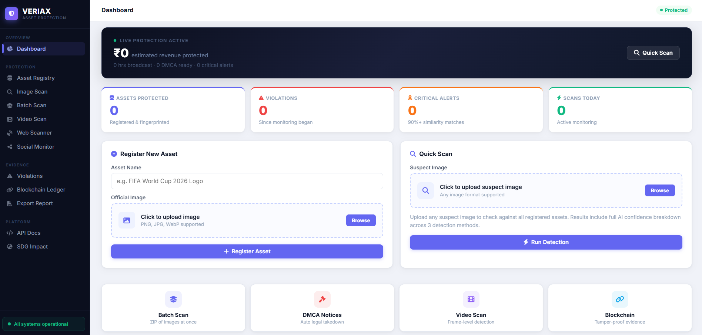
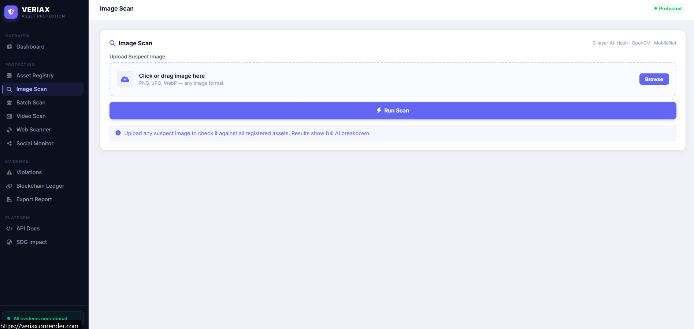
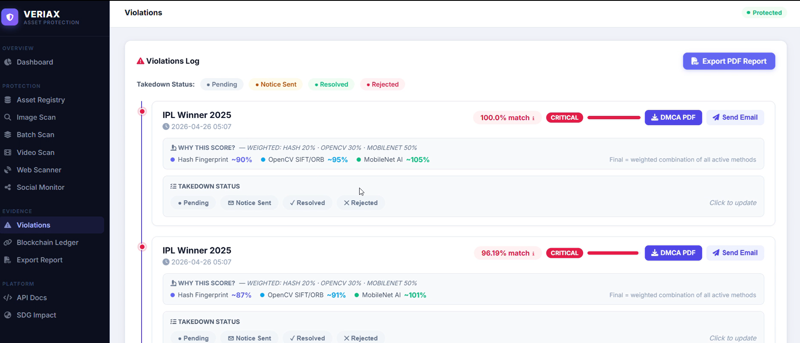
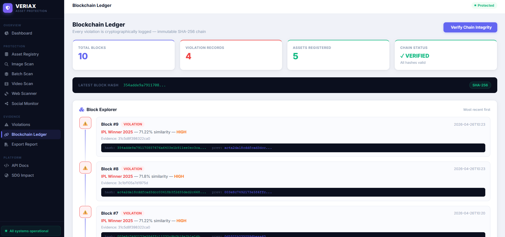
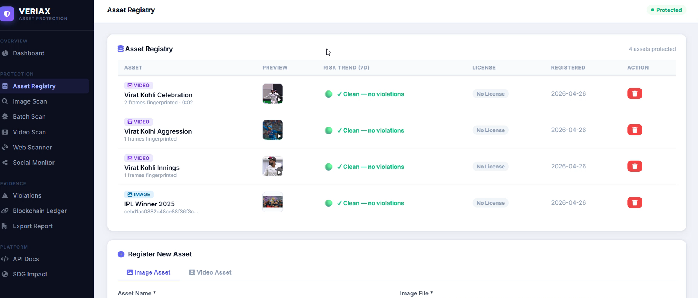
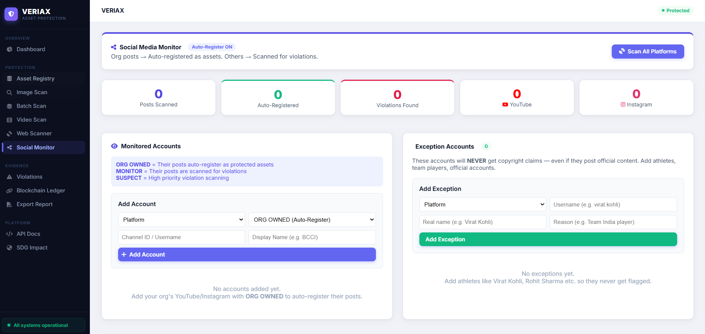

# VERIAX — Digital Asset Protection Platform

> AI-powered sports media copyright protection with blockchain evidence, DMCA automation, and real-time violation detection.

🌐 **Live Demo:** [https://veriax.onrender.com](https://veriax.onrender.com)

---

## 🧠 What is VERIAX?

VERIAX is an intelligent digital asset protection platform built for sports organizations, broadcasters, and media rights holders. It uses a **3-layer AI detection system** (Hash Fingerprint + OpenCV SIFT/ORB + MobileNet deep learning) to detect unauthorized use of images and videos across the web — and generates legally-ready DMCA takedown notices in one click.

---

## ✨ Features

### 🛡️ Protection
| Feature | Description |
|---|---|
| **Asset Registry** | Register images & videos with AI fingerprinting. Supports image and video assets with frame-level hashing. |
| **Image Scan** | Upload any suspect image and check it against all registered assets. Full AI confidence breakdown across 3 detection methods. |
| **Batch Scan** | Upload a ZIP of up to 50 images at once for bulk violation detection. |
| **Video Scan (Enhanced)** | Frame-by-frame extraction + 5-region detection. Detects violations even if logo is cropped or AI-removed. |
| **Web Scanner** | Automatically searches the internet for unauthorized use of your registered assets. |
| **Social Monitor** | Monitor YouTube & Instagram accounts. Org-owned posts auto-register as assets; others are scanned for violations. Supports exception accounts (e.g. athletes). |

### 🔍 Evidence
| Feature | Description |
|---|---|
| **Violations Log** | Full log of detected violations with weighted AI scores (Hash 20% · OpenCV 30% · MobileNet 50%). One-click DMCA PDF & email. |
| **Blockchain Ledger** | Every violation is cryptographically logged in an immutable SHA-256 chain. Chain integrity can be verified at any time. |
| **Export Report** | Generate and download full PDF evidence reports. |

### ⚙️ Platform
| Feature | Description |
|---|---|
| **REST API v2.0** | Integrate VERIAX detection into your own applications via `X-API-Key` header. |
| **SDG Impact** | Built to support UN SDG 9 — Industry, Innovation and Infrastructure. |

---

## 🤖 3-Layer AI Detection

```
Layer 1 — Hash Fingerprint   (weight: 20%)
  Perceptual hash comparison — detects exact and near-exact copies

Layer 2 — OpenCV SIFT/ORB    (weight: 30%)
  Feature-point matching — detects cropped, resized, or watermark-removed versions

Layer 3 — MobileNet AI       (weight: 50%)
  Deep learning embeddings — detects semantically similar content regardless of edits
```

Final score = weighted combination of all active methods.

---

## 📸 Screenshots

### Dashboard


### Image Scan


### Violations Log


### Blockchain Ledger


### Asset Registry


### Social Monitor


---

## ⚖️ VERIAX vs Existing Solutions

| Feature | VERIAX | Getty Images | Manual Monitoring | No Protection |
|---|---|---|---|---|
| AI-Powered Detection | ✅ 3-layer AI | ❌ Manual only | ❌ Human review | ❌ |
| Blockchain Evidence | ✅ SHA-256 proof | ❌ | ❌ | ❌ |
| Auto DMCA Letter | ✅ 1-click PDF | ❌ Manual | ❌ Manual | ❌ |
| Real-time Alerts | ✅ WhatsApp + Email | ❌ | ❌ | ❌ |
| Video Scan | ✅ Frame-by-frame | ❌ | ❌ | ❌ |
| Batch Scan (ZIP) | ✅ 50+ images at once | ❌ | ❌ | ❌ |
| API Access | ✅ Full REST API | ✅ Paid API | ❌ | ❌ |
| Cost | ✅ Low / Open | 💰 $$$ | 💰 High labor | ❌ Losses |
| Speed | ✅ <10 seconds | ⏳ Days | ⏳ Days–weeks | ❌ Never |

---

## 🚀 Getting Started

### Prerequisites
- Python 3.11.9
- pip

### Installation

```bash
# Clone the repository
git clone https://github.com/your-username/veriax.git
cd veriax

# Install dependencies
pip install -r requirements.txt

# Set up environment variables
cp .env.example .env
# Edit .env with your API keys

# Run the app
python app.py
```

The app will be available at `http://localhost:5000`

---

## 🔧 Environment Variables

Create a `.env` file with the following keys:

```env
SECRET_KEY=your_secret_key
DATABASE=database/sportshield.db
UPLOAD_FOLDER=uploads
GROQ_API_KEY=your_groq_key
FIREBASE_KEY=firebase-key.json
GOOGLE_SEARCH_API_KEY=your_google_key
GOOGLE_SEARCH_CX=your_search_cx
MAIL_EMAIL=your_email
MAIL_PASSWORD=your_app_password
ALERT_EMAIL=alert_recipient_email
SERPAPI_KEY=your_serpapi_key
YOUTUBE_API_KEY=your_youtube_key
TELEGRAM_BOT_TOKEN=your_telegram_token
TELEGRAM_CHAT_ID=your_chat_id
```

---

## 🌍 Deployment (Render)

This project is configured for [Render](https://render.com) via `render.yaml`.

```yaml
plan: starter          # Requires ≥1GB RAM for MobileNet
workers: 1
threads: 2
timeout: 180s
```

> ⚠️ **Important:** Do not use Render's free tier (512MB RAM). The MobileNet model requires ~400MB on first load. Use the **Starter** plan or above.

Push to GitHub and Render will auto-deploy:

```bash
git add .
git commit -m "your message"
git push origin main
```

---

## 🛠️ Tech Stack

- **Backend:** Python, Flask, Gunicorn
- **AI / CV:** PyTorch MobileNetV3, OpenCV SIFT/ORB, ImageHash
- **Database:** SQLite
- **Blockchain:** Custom SHA-256 chain (Python)
- **APIs:** Groq Vision AI, Google Search API, SerpAPI, YouTube Data API, Telegram Bot
- **Notifications:** Email (SMTP), Telegram
- **Deployment:** Render (backend), cloud-hosted frontend

---

## 📡 REST API

Base URL: `https://veriax.onrender.com`

### Generate API Key
```http
POST /api/v1/keys/generate
Content-Type: application/json

{ "name": "My App Name" }
```

### Check System Status
```http
GET /api/v1/status
```

All protected endpoints require:
```http
X-API-Key: ss_yourkey
```

Full documentation available at `/api-docs`.

---

## 📋 Project Structure

```
veriax/
├── app.py                    # Main Flask application
├── requirements.txt
├── render.yaml               # Render deployment config
├── database/
│   ├── db.py                 # SQLite init & helpers
│   └── sportshield.db        # Auto-created on first run
├── routes/
│   ├── assets.py             # Asset registry
│   ├── scan.py               # Image scan
│   ├── batch_scan.py         # Batch ZIP scan
│   ├── scanner.py            # Scheduled web scanner
│   ├── video_scanner.py      # Video frame extraction
│   ├── social_media.py       # Social media monitor
│   ├── deeplearning_detector.py  # MobileNet AI (lazy loaded)
│   ├── opencv_detector.py    # OpenCV SIFT/ORB
│   ├── gemini.py             # Groq Vision AI
│   ├── blockchain.py         # SHA-256 ledger
│   ├── report.py             # PDF report export
│   ├── api.py                # REST API endpoints
│   └── alerts.py             # Email/Telegram alerts
├── templates/                # Jinja2 HTML templates
└── uploads/                  # Auto-created, stores registered assets
```

---

## 🤝 Contributing

Pull requests are welcome. For major changes, please open an issue first to discuss what you would like to change.

---

## 📄 License

This project is licensed under the MIT License.

---

## 🏆 Built For

> SDG 9 — Industry, Innovation and Infrastructure
> Protecting sports media IP using accessible AI technology.

**Tech stack powering SDG 9:**
✅ MobileNet deep learning &nbsp; ✅ OpenCV SIFT/ORB vision &nbsp; ✅ SHA-256 blockchain &nbsp; ✅ Gemini AI forensics